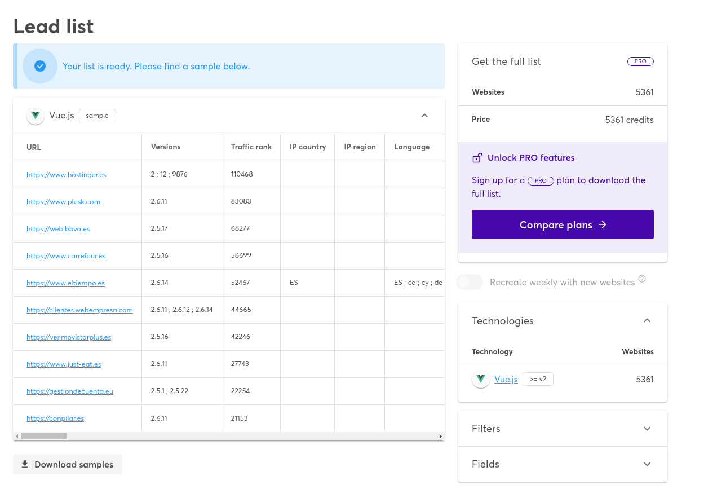

---

<!--
Hola a todos!!!!
- Mi nombre es Mario M de la comunidad JavaScript. Bueno sobre mi, contaros un poco que actualmente trabajo como Frontend developer en un proyecto para reservas de de Ferry + hotel para el cliente FRS - FlexIT. 
- En el proyecto estamos usando la versión 3 de Vue con Typescript y Testing Library, Jest para test unitarios y Cypress para e2e.
-->

---
# Vue en el mundo real
<!-- Comenzamos con la segunda parte de la conferencia "Vue en el mnudo real" 
- En esta sección el objetivo es comentar qué empresas y proyectos usan Vue actualmente en sus proyecto y por qué han decidido usar este framework. -->

---
<!-- _class: lead -->

# Qué vamos a tratar...
- Empresas y proyectos que usan Vue
    - Empresas más destacadas
    - Testimonios y opiniones de empleados 
- App / websites más importantes
- Por qué usan Vue estas compañías
<!--
- Empresas y proyectos más destacadas internacionales y algunas con sede o presencia en España, las cuales están USANDO VUE actualmente.

- También los proyectos y webs más destacados hechos con este framework. 

- Por último repasaremos un listado con las principales características y puntos fuertes de Vue, que hacen que se esté usando cada vez en más empresas y proyectos.
-->

---
<!-- _class: lead -->

# Empresas / proyectos destacados

<!-- 
Estas son algunas de las empresas que usan Vue actualmente. 
Como podéis observar muchas son empresas de referencia como Google, Apple, TikTok, BMW...
También destacar empresas del sector IT como es Storyblok, Monterail o Gitlab, de la cual empezamos a hablar a continuación.
-->

---
### Gitlab
*"Usamos Vue principalmente por su **Sencillez** y **facilidad de uso**"*
<!-- - El propio Gitlab tiene una entrada en su blog donde explica por qué eligieron Vue y básicamente es debido a su “Sencillez y facilidad de uso” -->
- [why-we-chose-vue](https://about.gitlab.com/blog/2016/10/20/why-we-chose-vue/)
<!-- También comentan que:
- Empezar a usar Vue.js es extremadamente fácil. 
- Su código fuente es muy legible
- La documentación oficial es el único tutorial que necesitarás
- No necesitas bibliotecas externas. 
- Tienes la posibilidad de elegir qué herramientas utilizamos. Por ejemplo, también si queremos meter TypeScript o JSX
-->

- [about.gitlab.com](https://about.gitlab.com/)
<!--
- Una de sus desarrolladoras Frontend "Natalia Tepluhina"
(Staff Frontend Engineer) comenta en el “State of Vue 2021”:
    - GitLab usa Vue porque era el mejor marco para la migración iterativa de jQuery para la configuración que teníamos.
    - También comenta que pudieron hacer partes de la página sin reescribir toda la interfaz desde cero.
    - Comenta que usan Vue porque es uno de las herramientas más flexibles y progresivas que han probado
-->

---
### Monterail
"*Vue tiene una gran documentación y guía de estilo, lo que hace que sea difícil usarlo de forma incorrecta.*" 

- Official Vue Partner
- Autores del “**State of Vuejs report**”
- [www.monterail.com](https://www.monterail.com/)

<!-- 
    - Empresa que ofrece todo tipo de servicios de desarrollo de software (web, mobile, design...)

    - Destacar de esta empresa que son  los AUTORES del reporte anual sobre el estado de Vue “**State of Vuejs 2021 report**” del cual os dejo el enlace al final de la presentación.

    - También importante destacar, que son Partner **Official de Vue.js.** El único con sede en Europa hasta ahora. (Polonia).
        - Si teneis curiosidad en saber más partners oficiales de Vue en la propia página de Vuejs.org
        - https://vuejs.org/resources/partners.html
            - Modus (agencia digital)
            - Rangle.io (consultora),

    - Uno de sus empleados Frontend Developer (Artur Rosa) comenta:
    - que Vue tiene una gran documentación y una guía de estilo, lo que hace que sea difícil usarlo de forma incorrecta.
    - También resalta que lo que más le gusta de Vue es que no hace falta conocer el framework para leer y entender el código.
    -->

---
### Storyblok
"*Me gusta la curva de aprendizaje. Si alguien domina HTML y CSS,  JS, Vue es muy fácil de aprender*" 

- [storyblok.com](https://www.storyblok.com/) 
<!-- 
- Headless CMS  (Strapi o Netlify).
- **su principal servicio es su  headless CMS.
    - Digamos que provee únicamente una interfaz administrativa** desde la que gestionar el repositorio de contenidos a publicar, **así como una API REST. En vez de tener acoplado  (BBDD, API, interfaz) como sería el caso de Wordpress.**

Uno de sus empleados (Samuel Snopko: Head of Developer Relations) comenta que
- “Le gusta la curva de aprendizaje y que acepta estándares HTML y CSS. Si alguien domina HTML y CSS,  JS, Vue es muy fácil de aprender”.
-->

---
## Algunas de las empresas más importantes

- **Google** [careers.google.com](http://careers.google.com/)
<!-- GOOGLE: Usa Vue para su página de carreras profesionales (Cloud engineering) -->

- **Apple** [tutorials-swiftui](http://tutorial.developer.apple.com/tutorials/swiftui)
<!-- APPLE: Entre otros proyectos, Apple usa Vue en su web de guía o tutorial de SwiftUI  -->

- **Zoom** [zoom.us](https://zoom.us/)
<!-- ZOOM: Usó Vue para desarrollar su aplicación web -->

- **BMW** → Car Configurator [bmwusa.com](https://www.bmwusa.com/build-your-own.html#/series)
<!-- BWM USA 
- SU sitio web BMW **Car Configurator** te permite diseñar un BMW a tu gusto y todo ello gracias a Vue.js.
-->

- **Adobe** [behance.net](https://www.behance.net/onboarding/adobe)
<!-- BEHANCE (Adobe)
- Utilizaron Vue para su aplicación web BEHANCE la cual es la principal plataforma online para mostrar y descubrir trabajos creativos.
-->

- **Nintendo** [nintendo.es](https://www.nintendo.es/)
<!-- NINTENDO: 
- usa Vue en varios de sus sitios web oficiales de España, Alemania y Francia entre otros, así como en su app de **My Nintendo.**, la cual es una aplicación para gestión de su sistema de recompensas para el usuario.
-->

---

<!-- BEHANCE
En este gif podemos ver la aplicación Behance de la empresa Adobe.
Como hemos comentado es uno de los principales productos. 

- Una manera rápida de detectar si una web o aplicación está usando Vue es a través de la herramiente Vue dev tools. De está herramienta nos contará más nuestro compañero Andrés más adelante.

- Como vemos en el gif, nos indica que la web usa Vue, pero que no es posible inspeccionar al detalle debido a que esta en MODO PRODUCCION.

- Otra extensión es "Wappalyzer" la cual te indica las tecnologías y librearías que usa la aplicación.

-->

---

<!-- NINTENDO 

ANGULARJS y  VUE
- Igualmente revisando los Vue Dev tools y Wappalyzer podemos ver el uso de Vue en esta web y también vemos que se usa ANGULARJS

- Este sería un ejemplo de la flexibilidad de Vue y como puede integrarse en aplicaciones existentes que ya usan otras tecnologías de Frontend. En este caso el framework AngularJS (versión 1).

- INSPECCIONAR CODIGO FUENTE:
Por otro lado, si no tuvieramos la ayuda de estas extensiones en Chorme, también podríamos detectar el uso de Vue en la web si inspeccionamos el código fuente.
- Como vemos en la imagen cuando se muestra el código fuente podemos ver como hay inyectado un script con un par de componentes de Vue. Seguramente la aplicación se inició en su día con AngularJS y ahora se están migrando partes o añadiendo nuevas funcionalidades con Vue.
-->

---
## Otras aplicaciones / websites

- Alibaba
<!-- ALIBABA --------------------------
- Como sabéis es una las principales plataformas de comercio electrónico del mundo.
- Como dato a destacar, comentar que el personal técnico de Alibaba no solo adoptó Vue.js como su principal solución de interfaz, sino que también desarrolló su propio marco compatible con Vue.js para crear interfaces móviles. Se llama **Weex**.

-En la imagen podemos ver la web Alibaa de IRÁN, el idioma si no me equivoco es el Farsi o Persa
-->

- Xiaomi
<!-- XIAOMI ----------------------------
- Utiliza Vue.js para construir sus productos lo que demuestra la fuerte adopción internacional del framework.
Destacar de esta empresa que tiene una valoración de más de 1.000 millones de dólares
-->

- Trivago
<!-- TRIVAGO ----------------------
- Aunque su principal tecnología front es React, está usando Vue en algunos de sus nuevos desarrollos
- Vue con Nuxt para su revista. [magazine.trivago.it](https://magazine.trivago.com/)**
-->

- Shopware
<!-- SHOPWARE ----------
- quería destacar también Shopware porque es una plataforma de comercio electrónico open-source, la cual cuenta con más de 800.000 descargas.

- Utiliza Symfony para el backend, y la interfaz de administración está completamente basada en Vue.js
-->

<!-- - **Otras**: [9GAG](https://9gag.com/), [MIT](https://www.mit.edu/), [NBC Sports](https://www.nbcsports.com/)  -->

<!-- 9GAG: Plataforma de social media -->
<!-- MIT:  Web oficial Massachusetts Institute of Technology. -->
<!-- NBC Sports Website noticias deportivas -->

---
### Websites con Nuxt.js
<!-- Quería hacer un apartado con mención especial a Nuxt, un framework basado en Vue, que entre sus principales características tiene la opción de
- SSR (Server Side Rendering), renderizado en el servidor, por lo que es muy usado para webs corporativas que necesitan ser SEO FRIENDLY (indexadas por motores de búsqueda)

- Nuestro compañero HECTOR más adelante, nos contará con más detalle sobre este framework.
-->

- [es.louisvuitton.com](https://es.louisvuitton.com/esp-es/homepage)
<!-- LOUIS VUITTON: Website para tienda online (Vue, Nuxt) -->

- [rolandgarros.com](https://www.rolandgarros.com/en-us/)
<!-- ROLANDGARROS: Website de información de este famoso torneo de tenis -->

- [livestorm.co](http://livestorm.co/) 
<!-- LIVESTORM: Aplicación web para conferencias y eventos online -->

- [tiktok.com/business/es](https://www.tiktok.com/business/es)

<!--TIKTOK: Web oficial de Tik Tok -->

<!-- _footer: https://nuxtjs.org/showcases/ -->

---

<!-- Aquí vemos un ejemplo de la web de TIK TOK for BUSINESS la cual está desarrollada con Nuxt. Seguramente una de las necesidades que require está web es que sirvasea SEO FRIENDLY

- Podemos ver que el icono de la Vue Dev tools cambia al de Nuxt. 
- Si lo abrimos nos indica que la web usa Vue y Nuxt.
Lo mismo con la extensión Wappalyzer, si la abrimos vemos que nos indica el uso de Vue y Nuxt, además del resto de librerías que usa la web.
-->

---
# En España
<!-- En este apartado quería destacar algunas empresas de nuestro país o con presencia aquí -->

- **Glovo** 
[glovoapp.com](https://glovoapp.com/)
<!-- GLOVO: 
Su app web está desarrollada con Vue -->

- **Movistar** [ver.movistarplus.es](https://ver.movistarplus.es/)
<!-- MOVISTAR+: 
Entre otras, su nueva aplicacion web streaming de videos  (televisión,series,etc) movistar+ está desarrollada con Vue -->  

- **Sprinter** [sprintersports.com](https://www.sprintersports.com/) (Nuxt)
<!-- SPRINTER: 
web de e-commerce hecha con Nuxt -->

- **Tous**
[tous.com](https://www.tous.com/es-es/) (Nuxt)
<!-- TOUS: 
tienda online hecha con Nuxt -->

---
### Webs más visitadas en España    

<!-- 
- Comentar que en esta tabla ha sido extraida de la web de Wappalyzer.

- La app te da la posibilidad de crear tus listados personalizados, con posiblidad de filtrar al hacer búsqueda:
- por framework o tecnología, por región o IP, por tipo o sector al que pertenece la web (webs de deportes, educación, sector bancario, etc)

- En este caso es una búsqueda de las webs con más tráfico en España (IP en España) que usan Vue.

------- RESULTADOS DE LA TABLA ---------------
En la imagen podemos ver que las dos primeras posiciones las ocupan dos empresas que proveen soluciones de hosting como son HOSTINGER y PLESK, seguida por BBVA y CARREFOUR.

Podemos ver datos como:
- Versiones de Vue que usa cada una
- Tráfico: numero de visitas al día ???
- País - IP

- Como último apunte, comentaros que la versión gratuita te crea un listado de ejemplos y para obtener el listado completo con más detalle tendríamos que ir al de pago. -->

<!-- _footer: Wappalyzer: https://www.wappalyzer.com/technologies/javascript-frameworks/vue-js -->

---
# Por qué usan Vue
<!-- Para finalizar esta sección de la conferencia, quería resaltar los puntos fuertes de Vue, lo que está haciendo que sea un framework muy utilizado actualmente -->

- **Flexibilidad**
<!-- FLEXIBILIAD
- Su flexibilidad. El framework se puede integrar muy bien en el código existente.
- Nos deja la posibilidad de elegir cómo estructuramos una aplicación o qué otras herramientas utilizamos. Por ejemplo, también si queremos meter TypeScript o JSX
- Es posible implementar características individuales de un sitio web o aplicación con Vue sin cambiar completamente la arquitectura existente.
-Es un framework PROGRESIVO - MODULAR. Esto significa que sólo tenemos las funciones básicas en la librería principal y podemos añadir más características en módulos adicionales. (router, i18n, etc)
- La ventaja aquí es que podemos cubrir los requisitos de un proyecto con precisión y así reducir la sobrecarga al mínimo.
- Esto es muy importante en general para todos los proyectos, pero aún más para proyectos en el que el se busca reducir al mínimo la carga. 
-->

- **Velocidad / Performance**
<!-- VELOCIDAD / PERFORMANCE
- El por qué de que muchas empresas están utilizando Vue es su VELOCIDAD.
- Vue tiene un algoritmo interno que asegura que sólo los cambios y las diferencias se escriben en el DOM real. De este modo, las operaciones complejas en el renderizado del navegador se optimizan y, por tanto, son más eficaces y rápidas.
- La versión 2 de Vue tenía ya buenos números en cuanto a velocidad , y ya con la salida de Vue 3 y especialmente las últimas versiones de Vue 3 (Vue3.2)s
-->

- **Popularidad**
<!-- POPULARIDAD
- Como hemos ido comentando a lo largo de esta sección del Vue tech day, actualmente lo usan grandes empresas y proyectos.
- También esta popularidad es gracias, en gran parte por su creado Evan You (antiguo empleado en Google) y su comunidad que hacen continuamente conferencias y dan visión al framework.
-->

- **Curva de aprendizaje** 
<!--  
- Tiene una CURVA DE APRENDIZAJE bastante fácil en comparación con otros frameworks.
- No es una arquitectura tan compleja como por ejemplo otros frameworks de Front como Angular
-->

- **Documentación oficial / Recursos**
<!-- DOCUMENTACION OFICIAL 
- Además, la documentación oficial nos facilita enormemente la comprensión de la estructura de forma inmediata. Con la ayuda de los ejemplos, se conocen las funciones básicas y se pueden implementar las primeras aplicaciones web con Vue.js en muy poco tiempo.
COMUNIDAD:
- Existen numerosas librerias (todas open-source) que nos ayudarán a desarrollar todo tipo de funcionalidades con el framework
- madewithvue.js
- vue-awesome
-->

---
# Conclusiones

- A día de hoy podemos decir que Vue:
    - Lo usan grandes empresas lo cual aumenta su popularidad.
    - Es un serio competidor de React y Angular
    - Es una gran alternativa como framework para crear nuestras interfaces de usuario.
    

---
### Más sobre Vue en el mundo real

- **Made with Vue**
[madewithvuejs.com/](https://madewithvuejs.com/)

- **Vue Awesome**
[https://github.com/vuejs/awesome-vue#open-source](https://github.com/vuejs/awesome-vue#open-source)
<!-- 
   Listado de proyectos open source y comerciales, app y websites, asi como libros, tutoriales, ejemplos. IMPRESCINDIBLE conocerlo para cualquier persona que trabaje con Vue. 
-->

- **Más websites con Nuxt**
[https://nuxtjs.org/showcases/](https://nuxtjs.org/showcases/)

- **State of Vue report**
[https://www.monterail.com/hubfs/state_of_vue_2021/State_of_vue.js_2021_report_by_Monterail.pdf](https://www.monterail.com/hubfs/state_of_vue_2021/State_of_vue.js_2021_report_by_Monterail.pdf)

--- 
<!-- _class: lead -->

# G R A C I A S !!!
<!--- Muchas gracias. Espero que os haya gustado!!!
No se si alguien tiene alguna pregunta. 
Si no pasamos a la siguiente parte de la conferencia.
-->

<!-- _footer: Mario Martín Sánchez. Comunidad JS. mmartin.sanchez@atsistemas.com -->

---

<!--
A continuación dejamos un poco de lado la teoría y pasamos la parte práctca. Doy paso a mi compañero Adrián.
-->